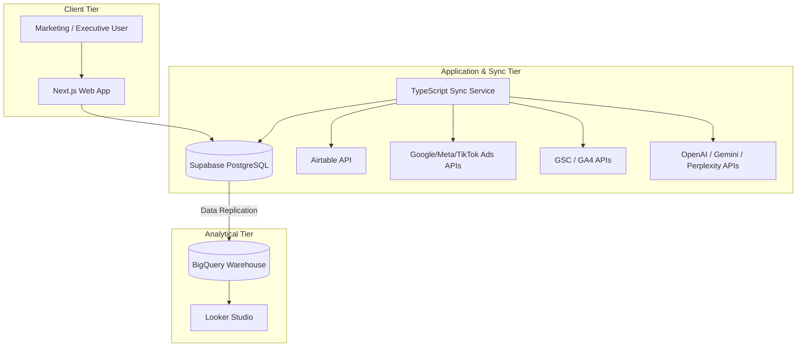

# Marketing ERP System Specification

**Topic:** Marketing ERP System Requirements & Architecture Specification  
**Date:** 2026-07-12  
**Status:** Under Review  
**Target File:** `docs/superpowers/specs/2026-07-12-marketing-erp-spec.md`

---

## 1. Executive Summary

This document specifies the requirements, module structures, and technical architecture for the **Brandname Marketing ERP** designed for **GO Mall** (the umbrella brand) and its subsidiary brands: **Rent A Coat**, **Winterra**, and **CoCoat**. 

The goal of this system is to bridge the gap between marketing spend/activity and actual revenue, provide tools for competitor comparison, manage content across channels, audit search and AI engine visibility, and track marketing team KPIs. The system builds upon the completed TypeScript backend integration foundation in `/Users/supatcharoenpot/Documents/Brandname Marketing` and the existing Next.js frontend in `/Users/supatcharoenpot/.gemini/antigravity/scratch/marketing-dashboard`, connecting directly to the **Supabase** operational database.

---

## 2. Business Context & Brand Routing

The system supports the following multi-brand structure:
1. **GO Mall (Umbrella Brand):** One-stop destination for winter apparel. Focused on retail/rental bundles, family sets, and rent + buy mixed deals.
2. **Rent A Coat (Rental-first Brand):** Highly trusted winter wear rental focusing on cleanliness, size confidence, warmth, and trip readiness. Handles premium global brands (The North Face, Columbia, MLB, Discovery, Moncler, Canada Goose) and winter accessory sales.
3. **Winterra (Owned Product Brand):** Functional and fashionable winter wear (long johns, cargo pants, chinies, gloves, socks) designed specifically for Thai travelers. Launching August 2026.
4. **CoCoat (In-store Imported Brand):** Operates as a merchandise line within the store, similar to Winterra but imported rather than built as a standalone digital brand.

*Note: GO Mall, Rent A Coat, and Winterra run active websites, social channels, SEO, SEM, and AI mention strategies. CoCoat shares the in-store layout and is grouped under GO Mall's channel tracking.*

---

## 3. Tech Stack

The production stack utilizes a robust, decoupled architecture for high-performance dashboard rendering and heavy integration batch-processing.

### 3.1 Backend Integration Hub (`brandname-marketing-integrations`)
*   **Runtime:** Node.js 22+ (TypeScript 5 strict mode)
*   **Web Framework:** Fastify (lightweight HTTP server for healthchecks, webhook listener, and manual trigger controls)
*   **Validation:** Zod (runtime contract schemas for incoming API payloads)
*   **Test Runner:** Vitest & Node test runner (with 160+ unit/integration tests running at 100% green status)

### 3.2 Frontend Dashboard (`marketing-dashboard`)
*   **Framework:** Next.js (App Router, React Server Components)
*   **Styling:** Tailwind CSS, Vanilla CSS
*   **UI Components:** Shadcn UI, TanStack Table
*   **State Management:** Supabase JS Client for secure, real-time database queries.

### 3.3 Database & Analytics
*   **Operational Database:** Supabase (PostgreSQL with Row Level Security (RLS) policies configured for role-based access control)
*   **Analytical Warehouse:** Google BigQuery (for historical trends, attribution modeling, and high-volume data-marts)
*   **Reporting BI:** Looker Studio (for flexible executive reports)

### 3.4 Hosting & Infrastructure (GCP)
*   **Compute:** Google Cloud Run (Serverless container runtime for both Next.js app and the Integration service)
*   **Scheduler:** Google Cloud Scheduler (Triggers the cron tasks for daily API imports and 15-minute Airtable syncs)
*   **Security:** Google Secret Manager (Stores API keys, OAuth tokens, and private keys)
*   **SSO:** Google Workspace OAuth (SSO authentication for internal employees)

---

## 4. ERP Modules & Requirements

### 4.1 Master Data & Governance
*   **Scope:** Manages master records for Brands, Branches, Channels, Connected Accounts, Campaigns, Product Master, Employees, Competitors, and UTM source dictionary.
*   **Branch Routing:** Distinguishes branches accurately (e.g., `rac-rama9`, `gomall-rama9`, `rac-vibhavadi`, and the future `phetkasem-future` site).
*   **Location Migration Safety:** Restricts mutation of high-value `rac-vibhavadi` Google Business Profile (GBP) location. GBP integration is read-only.
*   **Audit Trail:** Logs every approval request, manual mapping override, and account modification.

### 4.2 Integration Hub
*   **Supported APIs:** Airtable, Google Search Console (GSC), Google Analytics 4 (GA4), Google Ads, Google Business Profile (GBP), Meta Graph/Marketing APIs, TikTok Business API, LINE Messaging API, FlowAccount (read-only reconciliation).
*   **Ingestion Policy:** Airtable sync runs incrementally every 15 minutes. Ad platforms and search networks sync daily. Sync routines are designed to be idempotent and replay-safe.

### 4.3 Revenue & Customer Analytics
*   **Source of Truth:** Airtable bases (separated for Rent A Coat and GO Mall) are the transaction source of truth.
*   **Normalized Contracts:** Financial figures are calculated in **integer satang** (to prevent floating-point rounding errors).
*   **Revenue Categories:** Rental (`RE`), Sales (`CA` from `Sale_Product_Master`), Wash, Asset Sale, B2B, Barter, Damage Fee, and Late Fee.
*   **Exclusions:** Deposits and refunds are handled as settlement metrics, excluded from recognized revenue.
*   **Reconciliation:** Automatically reconciles transactions grouped under `order_group_id` for rent+buy bundles or family sets.

### 4.4 Campaign & Budget Management
*   **Scope:** Planning annual, quarterly, and monthly budgets per brand and channel.
*   **Tracking:** Provides dashboard widgets for Planned Budget, Committed Budget, Actual Spend (from Ads APIs), Forecast, Variance, and Pacing.
*   **Pacing & Alerts:** Sends alerts to Slack/email when ad spend pacing deviates more than 15% from the planned trajectory.

### 4.5 Content Operations
*   **Content Calendar:** Single dashboard tracking content drafts, review status, and publication schedule across Facebook, Instagram, TikTok, LINE, GBP, and websites.
*   **Workflow Stage:** Draft $\rightarrow$ Review $\rightarrow$ Approved $\rightarrow$ Scheduled $\rightarrow$ Published $\rightarrow$ Measured $\rightarrow$ Archived.
*   **Taxonomy:** Organizes items by Content Pillars, Funnel Stage (Awareness, Consideration, Conversion, Retention), Target Brand, Audience, and Product Category.

### 4.6 SEO, SEM, & AI Visibility (GEO Auditing)
*   **Search Engine Visibility:** Tracks GSC metrics (queries, average position, CTR, click share) and GA4 session attributions. Matches keyword research and search volumes via Google Ads Keyword Planner API.
*   **AI Mention Simulation Engine (GEO Tracking):**
    *   Runs automated daily queries via OpenAI, Gemini, and Perplexity APIs simulating traveler search queries (e.g., "เช่าชุดกันหนาวที่ไหนดี", "ลองจอนแบรนด์ไหนดี").
    *   AI parses the engine output to record: cited brands, recommended products, cited URLs, and competitive mentions.
    *   Calculates a metric called **AI Share of Voice (SoV)** for Rent A Coat, GO Mall, and Winterra compared to competitors.

### 4.7 Competitor Intelligence (Hybrid Model)
*   **Seed Competitors:** `mellowrentcoat`, `winterclothing`, `becloset`, `cocorentt`, and `24dec`.
*   **Hybrid Data Collection:**
    *   *Automated:* SERP API tracks competitor organic SEO positions; Meta Ad Library API monitors active ad counts and creative themes of competitor pages.
    *   *Manual:* Forms for the marketing team to record competitor campaign pricing, active bundle deals, specific strengths/weaknesses, and upload screenshots of competitor offers.
*   **Gap Analysis:** Calculates price differentials and highlights "Opportunity Gaps" for GO Mall bundle offers.

### 4.8 Team KPI & Workflow (Hybrid Scorecards)
*   **Performance + Activity-Based Scorecards:**
    *   *Activity Metrics (Output):* Counts content written, reviewed, and published by team member (from `content_ideas` table), and ad groups launched.
    *   *Performance Metrics (Outcomes):* Pulls impressions, conversion metrics (CPL, conversions), and budget efficiency (ROAS/CPA) from integrated ad platforms, mapped to the respective channel owner.
*   **Versioning:** Targets are versioned to preserve historical scorecard accuracy when future KPI benchmarks are updated.

### 4.9 Reconciliation & Data Quality
*   **Airtable $\leftrightarrow$ FlowAccount:** Compares transaction subtotal, VAT, total, and payment status. Mismatches are flagged to an Actionable Reconciliation Queue.
*   **Validation Queues:** Lists records with missing keys, unknown SKUs, stale data sources, or mismatched RE/CA combinations.

### 4.10 Omnichannel Chat & Agent Copilot (Chat Replying Solution)
*   **Unified Multi-Channel Inbox:** Aggregates incoming customer chats from LINE OA, Facebook Messenger, Instagram DM, and TikTok messages into a single, unified view in the Next.js ERP dashboard.
*   **Airtable Customer Match & Context Card:** Dynamically matches chat handlers (e.g. LINE ID or FB Page user ref) with Airtable customer profiles. Displays a Customer Context Card showing:
    *   Active sizes (boots height, pants/shirt length) from WooCommerce/Airtable attribute records.
    *   Past rental history (`RE` records), active trip destinations, and trip dates.
*   **AI Chat Copilot (LLM-driven helper):**
    *   *Suggested Drafts:* Uses Gemini/OpenAI API with the store's knowledge base (warmth guidelines, inventory, sizing chart) to instantly draft suggestions for agents, solving agent response delays.
    *   *AI Extract-and-Tag:* Automatically extracts traveler travel destinations, trip dates, rental/purchase intent, and specific customer pain points/objections directly from messages, inserting them into `conversations` and `conversation_extractions` tables.
*   **Transactional Quick-Actions:** Direct button integration to send size charts, checkout invoice drafts, or payment links directly into the active chat window.

---

## 5. Identified Gaps & Missing Items (Production-Ready Action Items)

Based on the study of `/Users/supatcharoenpot/Documents/Brandname Marketing/docs/integrations/account_matrix.md`:

1.  **Meta Ads Agency Account Barrier:** Rent A Coat's paid media is agency-managed. Direct API access is unavailable. 
    *   *Remedy:* We must set up a manual upload system or invite the agency to link their MCC/Business Manager with a restricted access token.
2.  **TikTok Shop & Creator Data:** The current `CentralApiHub` (in `marketing-dashboard`) has empty placeholders for TikTok Shop data.
    *   *Remedy:* Integrate TikTok Shop Open API for product demand insights when Winterra/CoCoat retail sales go live.
3.  **LINE OA Export Formatting:** LINE chat export needs parsing into the `conversations` table to feed the AI customer pain-point extractor.
    *   *Remedy:* Write an ingestion pipeline parser for `.txt` chat logs or connect LINE Webhook events.
4.  **BigQuery Replicators:** The foundation handles PostgreSQL. The BigQuery ETL replicator for long-term analytical storage is planned but not yet implemented.

---

## 6. Next Steps & Implementation Roadmap

Following the foundation code launch, the roadmap includes:
1.  **GCP Resources Setup:** Provision Cloud SQL (PostgreSQL), Secret Manager, Cloud Run instances, and Cloud Scheduler triggers.
2.  **Database Migration Execution:** Apply Supabase/PostgreSQL initial schema migrations (`20260708055859_brandname_market_intelligence_initial_schema.sql` etc.) to the production database.
3.  **Integration Activation (Phase 1):** Deploy GSC, GA4, Google Ads, and Airtable Sync workers.
4.  **AI GEO Audit Engine Integration (Phase 2):** Implement the OpenAI/Perplexity simulation cron tasks.
5.  **Frontend Dashboard Assembly (Phase 3):** Bind Next.js charts and TanStack tables to the Supabase client, implementing the RLS policies and Google Workspace SSO.
